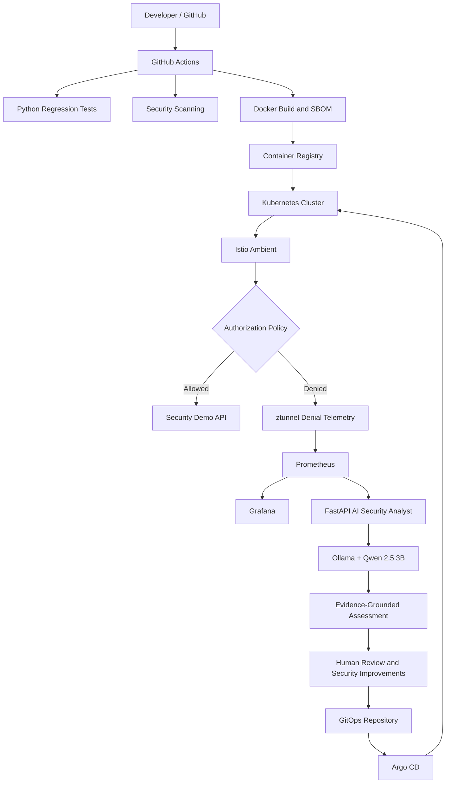

# Cloud-Native Security Platform

**An end-to-end security engineering lab combining DevSecOps, GitOps, Kubernetes runtime security, observability, and AI-assisted security investigation.**

This project demonstrates how security can be integrated throughout the software delivery lifecycle—from source code and automated security testing to Kubernetes runtime protection, telemetry collection, and AI-assisted investigation.

The platform uses GitHub Actions for CI, Argo CD for GitOps delivery, Istio Ambient for workload-level security, Prometheus and Grafana for observability, and a FastAPI-based AI Security Analyst powered by Ollama and Qwen 2.5 3B.

## Architecture


### End-to-End Workflow



## Key Features

### 1. DevSecOps CI Pipeline

Automates testing and security checks using GitHub Actions.

- Python regression tests with pytest
- Semgrep for static application security testing (SAST)
- Gitleaks for hardcoded secret detection
- Trivy for vulnerability scanning
- Checkov for Terraform and infrastructure-as-code scanning
- Conftest / OPA for policy validation
- Docker image build
- CycloneDX Software Bill of Materials (SBOM) generation

**Objective:** Identify potential issues early in the software delivery lifecycle.

### 2. Containerization and Registry

- Docker-based application packaging
- GitHub Container Registry (GHCR) and/or local Docker registry
- Container image vulnerability scanning
- SBOM generation for software inventory and supply-chain visibility

### 3. GitOps with Argo CD

Argo CD monitors Git-managed configuration and reconciles the desired state with the Kubernetes cluster.

- Declarative Kubernetes configuration
- Automated synchronization when configured
- Continuous reconciliation
- Application health and synchronization visibility

### 4. Kubernetes Runtime Security with Istio Ambient

The project uses Istio Ambient to demonstrate service-to-service security.

- Strict mutual TLS (mTLS)
- Workload identity
- Kubernetes service accounts
- Istio AuthorizationPolicy
- Authorized and unauthorized workload testing
- Runtime policy enforcement

The demo API is protected so that the designated test-client identity is allowed while an unauthorized identity is denied.

### 5. Security Observability

Prometheus collects runtime telemetry, while Grafana provides dashboards and exploration.

The project uses denial-related Istio telemetry to investigate blocked connections and understand the source and destination workloads.

Example Prometheus query:

```promql
istio_tcp_connections_failed_total{response_flags="DENY"}
```

Available labels can help identify the source workload, source principal, destination workload, destination service, and connection security policy.

### 6. AI Security Analyst

A FastAPI application retrieves denial evidence from Prometheus and uses a locally hosted Ollama model (`qwen2.5:3b`) to produce a structured security assessment.

Known endpoints in the deployed version:

| Endpoint | Purpose |
|---|---|
| `GET /health` | Check service health and model information |
| `GET /evidence/denied-connections` | Retrieve structured denial evidence |
| `POST /ai/analyze-denied-connections` | Generate an evidence-grounded assessment |

The analyst helps summarize:

- Observed security events
- Source and destination workload identities
- Evidence-supported findings
- Uncertainties and investigation gaps
- Recommended validation and troubleshooting steps

**Important:** A denied connection does not, by itself, prove malicious intent or a successful compromise. AI-generated findings must be validated against telemetry, workload ownership, application behavior, and security policies.

## Technology Stack

| Category | Technologies |
|---|---|
| Source Control | Git, GitHub |
| CI/CD | GitHub Actions |
| Testing | Python, pytest |
| Code and Secret Scanning | Semgrep, Gitleaks |
| Vulnerability Scanning | Trivy |
| Infrastructure Security | Terraform, Checkov |
| Policy Validation | Conftest, Open Policy Agent (OPA) |
| Containers | Docker |
| Container Registry | GHCR, Local Docker Registry |
| Kubernetes | kind, kubectl |
| GitOps | Argo CD |
| Service Mesh | Istio Ambient, ztunnel |
| Runtime Security | mTLS, AuthorizationPolicy, Workload Identity |
| Monitoring | Prometheus |
| Visualization | Grafana |
| AI Backend | FastAPI, Ollama, Qwen 2.5 3B |

## Repository Structure

```text
cloud-native-security-platform/
├── .github/
│   └── workflows/
│       └── security-pipeline.yml
├── ai-security/
│   └── tests/
│       └── test_security_assessment.py
├── application/
├── gitops/
├── infrastructure/
│   └── terraform/
├── kubernetes/
├── security/
├── docs/
│   └── architecture.png
└── README.md
```

## Local Environment

The project has been exercised using Windows, PowerShell, Docker Desktop, kind, kubectl, Terraform, Python, and Ollama.

The main cluster used for the Istio security demonstration is:

```text
kind-istio-security-lab
```

Other Kubernetes clusters may exist on the same machine. Verify the active context before running commands that modify cluster resources.

### Prerequisites

- Git
- Docker Desktop
- kind
- kubectl
- Terraform, for the infrastructure components you choose to provision
- Python 3.13 and `venv`
- Ollama with the `qwen2.5:3b` model
- Access to the GitHub repository and configured container registry

### Verify the Kubernetes Context

```powershell
kubectl config current-context
kubectl config get-contexts
kubectl get nodes
```

Confirm that you are working with the intended project cluster.

### Run Regression Tests

From the repository root:

```powershell
python -m venv .venv

.\.venv\Scripts\python.exe -m pip install -r .\ai-security\requirements.txt pytest

.\.venv\Scripts\python.exe -m pytest .\ai-security\tests -v
```

The regression tests cover evidence-grounded security findings, unsupported compromise claims, mTLS interpretation, unknown protocol context, existing non-denial behavior, and assessment immutability.

**Previously verified:** Six regression tests passed. Re-run the suite against your current checkout to confirm the result.

### Verify the Authorized Request

The authorized test client should be allowed to access `security-demo-api` on port `8080`.

```powershell
kubectl exec security-test-client -- sh -c "wget -S -O- -T 5 http://security-demo-api:8080/"
```

Expected behavior: HTTP 200 with a healthy response.

### Inspect Runtime Denial Telemetry

Query Prometheus:

```promql
istio_tcp_connections_failed_total{response_flags="DENY"}
```

Inspect the available source and destination labels and correlate the signal with ztunnel logs.

Telemetry samples should not automatically be interpreted as distinct security incidents or malicious actors.

### Access the AI Security Analyst

If port `8001` is not already forwarded, run:

```powershell
kubectl -n ai-security port-forward svc/ai-security-analyst 8001:8001
```

In another PowerShell terminal, check service health:

```powershell
Invoke-RestMethod http://localhost:8001/health
```

Retrieve denial evidence:

```powershell
Invoke-RestMethod http://localhost:8001/evidence/denied-connections
```

Generate an AI assessment:

```powershell
Invoke-RestMethod `
  -Method Post `
  -Uri http://localhost:8001/ai/analyze-denied-connections
```

If port `8001` is already forwarded, reuse the existing session instead of starting a duplicate.

## CI Security Considerations

The GitHub Actions workflow includes automated tests and multiple security scanning tools.

Some scan steps have used non-blocking configurations. Consequently, a successful workflow run does not necessarily mean every security scan passed without findings.

Before treating the pipeline as an enforced security gate:

- Define which findings should fail the build.
- Configure and test the appropriate exit codes.
- Review individual scan results and generated reports.
- Protect registry credentials and other secrets.
- Validate image provenance and deployment controls.

## Security Principles

- **Least privilege:** Restrict service access to expected workload identities.
- **Defense in depth:** Combine CI checks, container scanning, Kubernetes controls, runtime policy, and observability.
- **Evidence before conclusions:** Separate observed events from hypotheses.
- **Human validation:** Review AI-generated findings before making security changes.
- **Regression testing:** Protect important security assessment behavior through automated tests.
- **Safe operations:** Verify the target cluster before modifying or cleaning up resources.

## End-to-End Demonstration

A repeatable project demonstration follows this sequence:

1. Trigger a GitHub Actions workflow and inspect test and security scan results.
2. Review Argo CD application health and synchronization status.
3. Send a request from the authorized test client and verify HTTP 200.
4. Send a controlled request from an unauthorized client and verify policy denial.
5. Inspect ztunnel logs and Prometheus denial telemetry.
6. Explore the signal in Grafana.
7. Run the AI Security Analyst and compare its assessment with the collected evidence.
8. Explain the observed behavior, remaining uncertainties, and possible security improvements.

## Current Scope and Limitations

This is a local security engineering lab, not a production-ready security platform.

- The architecture diagram represents the system design, not a live status dashboard.
- CI enforcement depends on the configured behavior of individual scan steps.
- AI assessments depend on telemetry quality, model output, and service availability.
- A policy denial is not proof of compromise.
- Registry and deployment behavior depend on the current configuration.
- Production use would require additional work on secrets management, image provenance and signing, enforced security gates, availability, alerting, and operational procedures.

## Roadmap

Potential future improvements:

- Enforce selected CI security findings using documented severity thresholds.
- Add image signing and provenance verification.
- Improve GitOps promotion and deployment verification.
- Add runtime security dashboards and actionable alert rules.
- Expand tests for Prometheus errors, malformed model output, and AI service timeouts.
- Add Kiali for service-mesh topology visualization.
- Add end-to-end tests for the complete denial-to-assessment workflow.
- Document production deployment boundaries and secrets handling.
